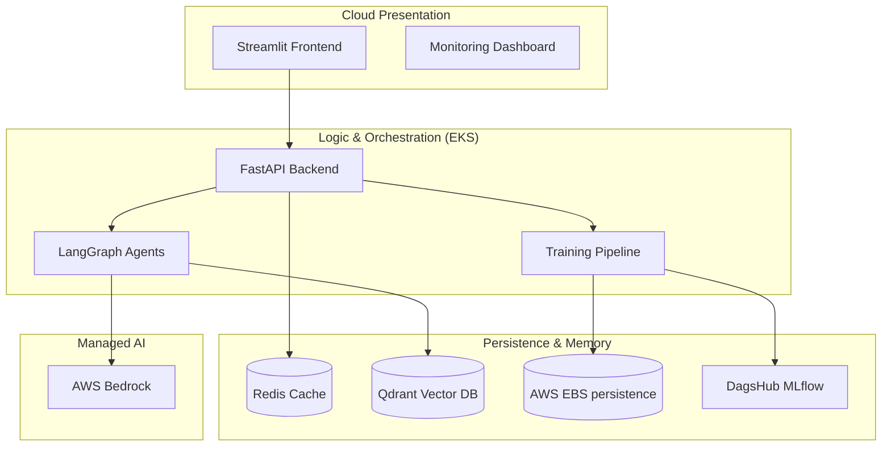

# 📈 MLOps Pipeline: End-to-End Stock Agent on AWS EKS

[](https://github.com/kmeanskaran/stock-agent-ops/blob/main/LICENSE)
[](https://www.python.org/downloads/)
[](https://www.terraform.io/)
[](https://aws.amazon.com/eks/)
[](https://mlflow.org/)

> **An end-to-end automated system for weekly stock market analysis using Transfer Learning (LSTM) and Agentic AI (AWS Bedrock), orchestrated on Kubernetes.**

---

## 🏗️ Quick Start (Cloud Deployment)

For full details, see the [AWS Deployment Guide](./doc/AWS.md).

### 1. Provision Infrastructure (~15 min)
```bash
cd terraform
terraform init
terraform apply -auto-approve
```

### 2. Connect to Cluster
```bash
aws eks update-kubeconfig --region us-east-1 --name mlops-stock-cluster
```

### 3. Deploy Applications
```bash
kubectl apply -f k8s/
```

---

## 🌟 Overview

This project is a production-grade MLOps pipeline that automates the entire lifecycle of stock price prediction and financial reporting. It leverages **cloud-native** patterns to ensure scalability, security, and automated delivery.

### Key Capabilities:
- **🧠 Transfer Learning**: Uses a Parent-Child architecture (S&P 500 base model) to predict individual stock prices accurately.
- **🤖 Agentic AI**: A multi-agent system powered by **AWS Bedrock (Llama 3)** that generates institutional-grade financial reports.
- **🏗️ Cloud Native**: Fully provisioned with **Terraform** and running on **AWS EKS** (Kubernetes).
- **⚡ Real-time Serving**: Low-latency predictions powered by FastAPI and Redis caching.
- **🔍 Observability**: Full-stack monitoring with Prometheus, Grafana, and Evidently AI.

---

## 🏗️ Technical Architecture



---

## 🛠️ Tech Stack

| Component | Technology |
| :--- | :--- |
| **Cloud Platform** | AWS (EKS, ECR, VPC) |
| **IaC** | Terraform |
| **LLM Engine** | AWS Bedrock (Llama 3 70B) |
| **Embeddings** | AWS Bedrock (Titan) |
| **AI Agents** | LangGraph, LangChain |
| **Feature Store**| Feast |
| **Registry** | MLflow (via DagsHub) |
| **Vector DB** | Qdrant (Semantic Caching) |
| **Cache** | Redis Stack |
| **Backend** | FastAPI (Async) |
| **Frontend** | Streamlit |
| **Observability**| Prometheus, Grafana |

---

## 🤖 Agentic AI Workflow

The system employs 4 specialized agents coordinated by **LangGraph**:

1. **Performance Analyst**: Interprets raw LSTM forecasts and technical indicators.
2. **Market Expert**: Scrapes latest news and sentiment using specialized financial tools.
3. **Report Generator**: Synthesizes data into a professional financial markdown report.
4. **Critic**: Reviews the output for consistency and logic before final serving.

**Semantic Caching**: Reports are embedded (using AWS Titan) and stored in **Qdrant**. If a similar query (95%+ match) is requested, the system serves the cached report instantly.

---

## 📊 MLOps Practices

- **CI/CD**: Automated deployment via GitHub Actions (building from root context).
- **Model Registry**: Every training run is logged to DagsHub with artifacts (scalers, plots, metrics).
- **Auto-Scaling**: EKS Node Groups configured for performance (`t3.xlarge`).
- **Persistence**: Dynamic EBS volume provisioning for data durability.

---

## 🤝 Connect & Support

If you find this project helpful, let's connect!

<a href="https://x.com/kmeasnskaran" target="_blank">
    
</a>
<a href="https://linkedin.com/in/kmeanskaran" target="_blank">
    
</a>
<a href="https://linkedin.com/in/kmeanskaran" target="_blank">
    
</a>

---

## 📜 License

Distributed under the MIT License. See `LICENSE` for more information.

---

Created with ❤️ by **Karan**
