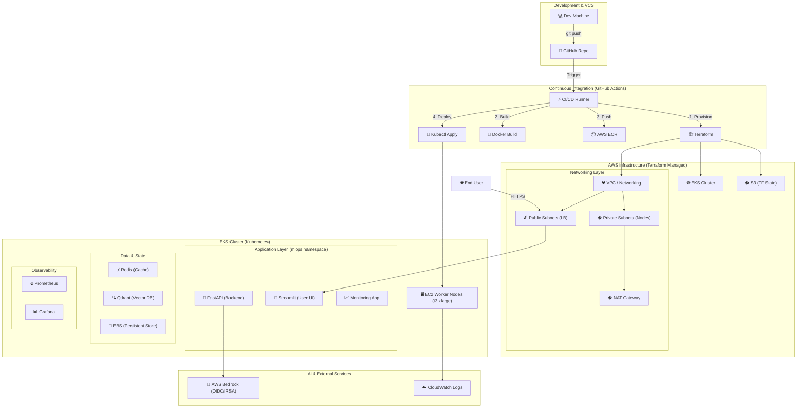

# 🚀 MLOps Stock Agent: Cloud Architecture & AWS EKS Deployment

This document serves as the primary system design and operational guide for deploying our MLOps Stock Prediction Pipeline to the AWS Cloud. It covers everything from infrastructure provisioning with Terraform to orchestrated deployments using Kubernetes (EKS) and automated CI/CD.

---

## 🏗️ System Architecture & Workflow

Our architecture is designed for scalability, persistence, and automated intelligence. We leverage AWS managed services to reduce operational overhead while maintaining full control over our containerized workloads.

### 📊 End-to-End Cloud Workflow
The following diagram illustrates the lifecycle of a code change: from a developer's commit to a live, monitored service on EKS.

---

## 🛠️ Section 1: Starting from Scratch on AWS

Deploying this system requires an initial "Level 0" setup to authorize your local environment and CI/CD tools.

### 1.1 IAM & Account Setup
- **Access Keys**: Create an AWS IAM user with programmatic access.
- **Permissions**: Attach the `AdministratorAccess` policy (or scoped-down policies for EKS, VPC, ECR, and IAM).
- **Region**: We primarily use `us-east-1`.

### 1.2 Local Tooling
- **AWS CLI**: Run `aws configure` to set your credentials.
- **Terraform 1.5.0+**: Our IaC engine.
- **kubectl**: Configured to talk to the EKS control plane.

### 1.3 Terraform Backend Bootstrapping
Before running Terraform, we need a place to store the "State" so that different developers and the CI/CD pipeline don't conflict.
- **Script**: `scripts/setup_tf_backend.sh`
- **Result**: Creates an S3 bucket named `mlops-stock-agent-params-tfstate`.

---

## 🏗️ Section 2: Infrastructure as Code (Terraform)

The `terraform/` directory contains the blueprint for our cloud environment.

### 🛰️ Networking (`vpc.tf`)
- **Isolation**: Workloads run in **Private Subnets**. They cannot be reached directly from the internet.
- **Outbound Access**: A **NAT Gateway** allows nodes to download models and talk to AWS Bedrock while keeping them hidden from external threats.
- **Inbound Traffic**: Managed via Public Subnets hosting Application Load Balancers.

### ☸️ The Control Plane (`eks.tf`)
- **Cluster**: A managed Kubernetes (EKS) cluster (v1.29).
- **Managed Node Groups**: We use **t3.xlarge** instances. 
    - **Why?** 16GB of RAM is necessary to host the FastAPI backend with large ML libraries (PyTorch/Transformers).
    - **Disk**: Configured with **50GB EBS Volumes** to avoid "Disk Pressure" issues during large image pulls.

### 📦 Image Registry (`ecr.tf`)
- Private **Elastic Container Registry (ECR)** repositories for each microservice. This ensures fast, secure image pulls within the AWS backbone.

### 🛡️ Secure Identity (`iam.tf`)
- **IRSA (IAM Roles for Service Accounts)**: We use an OIDC provider. Instead of injecting AWS keys into pods, the EKS pods "assume" an IAM role directly. 
- **Permission Scope**: Pods are granted specific access to **AWS Bedrock** and **CloudWatch**.

---

## ☸️ Section 3: Kubernetes Service Mesh

The `k8s/` directory defines how our applications run inside EKS.

### 🏗️ Namespace & Secrets
- **Namespace (`namespace.yaml`)**: Everything is isolated in the `mlops` namespace.
- **Secrets (`secrets.yaml`)**: Sensitive keys (API keys for Finnhub, AWS credentials) are stored as Kubernetes Secrets. In CI/CD, these are generated dynamically from GitHub Secrets.

### 🚀 Application Deployments
Our core services (`fastapi`, `frontend`, `monitoring-app`) use best-practice configurations:
- **Resource Management**: Each container defines `requests` and `limits` (e.g., 1Gi memory for FastAPI) to ensure stability.
- **Health Probes**: `readinessProbe` and `livenessProbe` tell Kubernetes when a container is ready to receive traffic or needs a restart.
- **Volumes (`volumes.yaml`)**: We use `PersistentVolumeClaims` (PVC) backed by **AWS EBS**. This ensures that vector data in Qdrant and cached data in Redis survive even if a pod is deleted.

### 📊 Observability Stack
- **Prometheus (`prometheus.yaml`)**: Scrapes `/metrics` endpoints from the backend.
- **Grafana (`grafana.yaml`)**: Visualizes performance. Connects to Prometheus at `http://prometheus:9090`.

---

## ⚡ Section 4: GitHub CI/CD Pipeline

The `.github/workflows/deploy.yml` acts as the orchestrator for every code update.

### The Deployment Sequence:
1.  **Terraform Sync**: Runs `terraform apply` to ensure any infrastructure changes (like new variables or instance upgrades) are reflected in AWS.
2.  **Context-Aware Docker Build**:
    - **Critical**: Docker builds are executed from the **project root**. This ensures the backend images can import modules from both the `backend/` and `src/` directories.
3.  **Secure Push**: Images are tagged with the specific Git SHA and pushed to ECR.
4.  **Dynamic Manifest Updates**: The workflow uses `sed` to replace the repository placeholders in the K8s YAMLs with the actual AWS Account ID registry URL.
5.  **Rolling Updates**: `kubectl apply` and `kubectl rollout restart` ensure a zero-downtime transition to the newer version.

---

## 🚀 How Everything Runs in Sequence

1.  **GitHub Push**: A developer pushes code to `main`.
2.  **Infrastructure**: Terraform ensures S3, VPC, EKS, and ECR are ready.
3.  **Building**: Docker images are baked and shipped to ECR.
4.  **Orchestration**: Kubernetes pulls the new images.
5.  **State Loading**: Redis and Qdrant connect to their EBS volumes; the FastAPI backend starts and passes its health checks.
6.  **Traffic**: The LoadBalancer becomes healthy, and users can access the dashboards.

---
*Generated by Antigravity AI - Professional MLOps Architecture Guide.*
